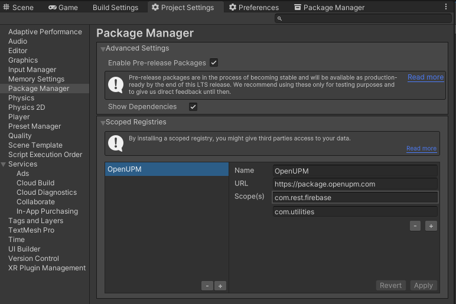

# com.rest.firebase.firestore

[](https://openupm.com/packages/com.rest.firebase.firestore/)

A Firebase.Firestore package for the [Unity](https://unity.com/) Game Engine.

## Installing

### Via Unity Package Manager and OpenUPM

- Open your Unity project settings
- Select the `Package Manager`

- Add the OpenUPM package registry:
  - `Name: OpenUPM`
  - `URL: https://package.openupm.com`
  - `Scope(s):`
    - `com.rest.firebase.firestore`
- Open the Unity Package Manager window
- Change the Registry from Unity to `My Registries`
- Add the `Firebase.Firestore` package

### Via Unity Package Manager and Git url

- Open your Unity Package Manager
- Add package from git url: `https://github.com/StephenHodgson/com.rest.firebase.firestore.git#upm`

## Documentation

### Project Setup

```csharp
// TODO
```
